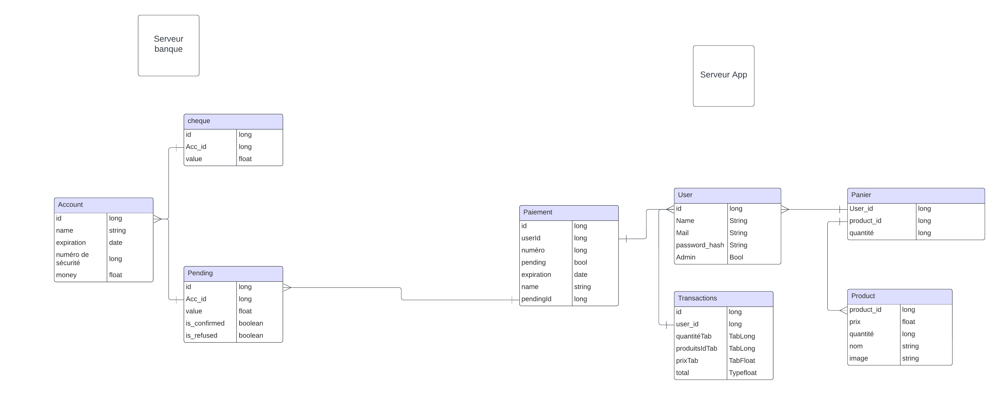

# 💸 Cash Manager Documentation

## Overview

Cash Manager is a retailer-oriented distant payment system designed to receive and execute orders from a mobile terminal app. This project encompasses both the mobile client (built with Vue.js and Tailwind CSS) and the bank server.

## Table of Contents

1. [Mobile Client](#mobile-client)
2. [Bank Server](#bank-server)
3. [Delivery](#delivery)
4. [Documentation](#documentation)
   - [Software Architecture Specification](#software-architecture-specification)
   - [Software Qualification](#software-qualification)
5. [Bonuses](#bonuses)
6. [Tools and Techniques](#tools-and-techniques)
7. [Project Construction](#project-construction)

## 📱 Mobile Client

The mobile client, developed using Vue.js and Tailwind CSS, serves as a terminal app for users. It includes the following features:

### Screens:

1. **🔐 Registration:**
   - Log into a customer account
   - Log into an admin account
   - Create a new account

2. **🛒 Home:**
   - Add articles to the cart.
   - Access other pages through buttons.
   - Real-time updating of the bill.

3. **💳 Bill Total Screen:**
   - Display the total bill.

4. **💰 Payment Screen:**
   - Scan card (NFC Reader) or cheque (QR Code scanner).
   - Display payment status: pending authorization, accepted, or refused.

5. **👤 Admin:**
   - Can create products
   - Can delete products
   - Can make purchases, can also be a customer

6. **🛠️ Profile:**
   - View personal information
   - View transactions
   - Add a credit card
   - Save a credit card

7. **🔄 Transaction:**
   - View the history of orders

## 🏦 Bank Server

The bank server handles requests from the terminal app and performs the following tasks:

- Receive requests.
- Authenticate based on stored data.
- Fetch data from the bank account.
- Accept or refuse payments based on credit card/check info + funds.
- Notify the mobile app.
- Update the user's account.

### Documentation:

We have a thorough documentation with fully commented code, and here's the project diagram for your review.

## Bonuses

- Real authentication protocol with security checks.
- Formal specification documents,
- Admin of the server,
- UML diagrams.